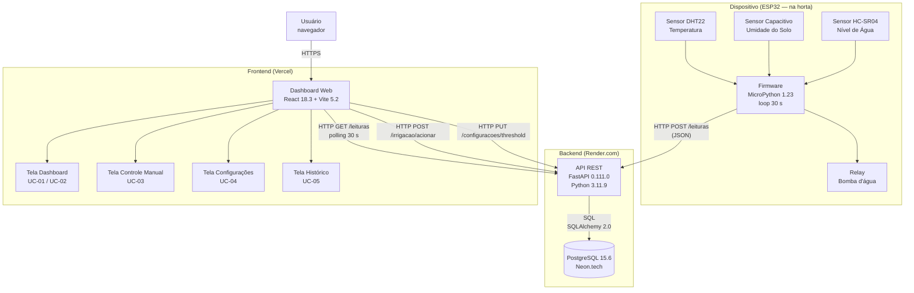

# RFC-001: Arquitetura do MVP — Horta Inteligente

## Cabeçalho

| Campo     | Valor                                        |
|-----------|----------------------------------------------|
| Status    | Aceito                                       |
| Versão    | 0.1                                          |
| Autores   | Nathan Junior, Bruno Avelino, Kauã Martins   |
| Data      | 2026-05-10                                   |
| Marco     | Marco 2 → Marco 3 do PI                      |
| Substitui | —                                            |

---

## 1. Contexto e Motivação

Hortas domésticas e escolares dependem de irrigação manual e constante atenção do responsável. O problema concreto é duplo: o esquecimento leva o solo a secar e prejudica as mudas; o excesso de água apodrece as raízes e desperdiça um recurso hídrico. Hoje não existe nenhuma ferramenta acessível que monitore automaticamente as condições da horta e acione a irrigação somente quando necessário, sem exigir que o usuário esteja presente.

A Horta Inteligente resolve isso com um dispositivo instalado fisicamente na horta que lê temperatura do ar, umidade do solo e nível do reservatório de água continuamente, e um sistema web onde o responsável visualiza essas leituras em tempo real, configura quando a irrigação deve ser acionada automaticamente e pode acionar ou desligar a bomba manualmente a qualquer momento pela tela do computador ou celular. O sistema vive em ambiente externo (sujeito a variações de temperatura, umidade e sinal Wi-Fi) e seu usuário típico não tem perfil técnico — precisa de uma interface simples e sem ambiguidade.

---

## 2. Escopo deste Marco

**Dentro do escopo:**
- Firmware do ESP32 lendo os três sensores (temperatura, umidade do solo, nível de água) e enviando leituras à API a cada 30 segundos via Wi-Fi.
- API REST (FastAPI) recebendo, validando e persistindo leituras; avaliando threshold de irrigação; expondo endpoints para o dashboard.
- Banco de dados PostgreSQL persistindo histórico de leituras, configurações de threshold e log de comandos de irrigação.
- Dashboard web exibindo leituras em tempo real, histórico em gráfico de linha, controle manual da bomba e configuração do threshold.
- Lógica de irrigação automática baseada em threshold de umidade configurável pelo usuário.
- Deploy em serviços gratuitos: API no Render, banco no Neon.tech, frontend na Vercel.

**Fora do escopo (próximas RFCs):**
- Autenticação multi-usuário — v0.1 assume um único usuário (sem login).
- Notificações push ou e-mail de alertas.
- Suporte a múltiplos dispositivos ESP32 por conta.
- Aplicativo mobile nativo.
- Integração com previsão do tempo.
- UC-05 em escala real — histórico com 500k registros e teste de carga (entra na v0.2).

---

## 3. Requisitos Atendidos

- SRS (A1.2): [`docs/requirements/srs.md`](../requirements/srs.md)
- Casos de Uso (A1.3): [`docs/requirements/casos-de-uso.md`](../requirements/casos-de-uso.md)

**UCs críticos suportados por esta RFC:**
- **UC-01** — Visualizar leituras dos sensores em tempo real
- **UC-02** — Irrigação automática acionada por threshold de umidade
- **UC-03** — Acionar irrigação manualmente pelo dashboard
- **UC-04** — Configurar limite (threshold) de umidade
- **UC-05** — Consultar histórico de leituras

---

## 4. Stack Tecnológica

| Camada              | Tecnologia        | Versão        | Por quê (1 frase)                                                                             |
|---------------------|-------------------|---------------|-----------------------------------------------------------------------------------------------|
| Microcontrolador    | ESP32 (Espressif) | ESP-IDF 5.2.1 | Hardware já adquirido com Wi-Fi nativo e suporte a HTTP client.                               |
| Firmware            | MicroPython       | 1.23.0        | Mesma linguagem do backend — equipe não troca de contexto; `urequests` cobre todo o HTTP necessário. |
| Linguagem backend   | Python            | 3.11.9        | Curva de aprendizado conhecida pela equipe; ecossistema rico para API e testes.               |
| Framework backend   | FastAPI           | 0.111.0       | Validação de payloads via Pydantic garante que leituras fora do range físico nunca chegam ao banco. |
| ORM                 | SQLAlchemy        | 2.0.30        | Async nativo e migrations integradas via Alembic.                                             |
| Migrações           | Alembic           | 1.13.1        | Versionamento de schema integrado ao SQLAlchemy sem configuração extra.                       |
| Banco de dados      | PostgreSQL        | 15.6          | Queries de range por timestamp para o histórico; Neon.tech oferece tier gratuito com 500 MB. |
| Hospedagem BD       | Neon.tech         | —             | PostgreSQL gerenciado, tier gratuito, sem configuração de servidor.                           |
| Frontend            | React             | 18.3.0        | Equipe tem contato prévio; ecossistema maduro para dashboard com gráficos.                    |
| Build frontend      | Vite              | 5.2.11        | Build mais rápido que CRA; zero configuração para projetos React simples.                     |
| Gráficos            | Recharts          | 2.12.3        | Integração nativa com React; curva baixa; suficiente para linha de tempo de leituras.         |
| Hospedagem API      | Render.com        | —             | Deploy via GitHub Actions, tier gratuito com suporte a Python.                                |
| Hospedagem frontend | Vercel            | —             | Deploy automático a cada push; tier gratuito generoso para React/Vite.                        |
| Testes              | pytest            | 8.1.1         | Padrão Python; plugins para async e cobertura.                                                |
| Validação de schema | jsonschema        | 4.21.1        | Usado no contract test ESP32 ↔ API (ver docs/test-strategy/test-strategy.md).                |
| CI/CD               | GitHub Actions    | —             | Integrado ao repositório; gratuito para projetos públicos.                                    |

---

## 5. Arquitetura do Sistema

### 5.1 Diagrama de Componentes



A arquitetura tem três camadas fisicamente separadas: o dispositivo embarcado (ESP32 na horta), um backend stateless que contém toda a lógica de negócio, e um frontend estático que só fala com o backend via HTTP. A separação é necessária porque o ESP32 não pode expor uma porta pública diretamente (está atrás de NAT doméstico), e toda a lógica de irrigação — avaliação de threshold, log de comandos — precisa estar num componente que persiste estado mesmo quando o dispositivo perde conexão Wi-Fi temporariamente.

### 5.2 Fluxo de Dados (Cenários)

**Cenário 1: Leitura automática e irrigação automática (atende UC-01 e UC-02)**

1. Firmware lê DHT22 (temperatura), sensor capacitivo (umidade) e HC-SR04 (nível de água) via GPIO/ADC.
2. Firmware envia `POST /leituras` com payload `{ "temperatura": 28.5, "umidade": 42.0, "nivel_agua": 80.0 }` via HTTP JSON.
3. FastAPI valida o payload com Pydantic — campos ausentes ou valores fora do range físico retornam HTTP 422 e são descartados sem persistência.
4. API persiste a leitura: `INSERT INTO leituras (temperatura, umidade, nivel_agua, criado_em) VALUES (...)`.
5. API consulta o threshold configurado: `SELECT threshold_umidade FROM configuracoes WHERE id = 1`.
6. Se `umidade < threshold_umidade`, API insere registro em `comandos_irrigacao` com `origem = 'automatico'` e inclui `"comando_pendente": true` na resposta.
7. API retorna `HTTP 201 { "id": 847, "comando_pendente": true }`.
8. Firmware lê o campo `comando_pendente` e aciona o relay (bomba liga) via GPIO.
9. Firmware envia `POST /irrigacao/confirmar { "executado": true }` para registro do log.
10. Dashboard, no próximo polling de 30 s (`GET /leituras?limit=1`), exibe os novos valores e acende indicador visual "Irrigando agora".

**Cenário 2: Controle manual pelo usuário (atende UC-03)**

1. Usuário clica no botão "Acionar irrigação" na Tela de Controle Manual.
2. Frontend envia `POST /irrigacao/acionar` para a API.
3. API valida que não há irrigação já ativa, insere registro em `comandos_irrigacao` com `origem = 'manual'`, retorna `HTTP 200 { "status": "aguardando_confirmacao" }`.
4. Dashboard exibe aviso: "Comando enviado — chegará ao dispositivo em até 30 s."
5. Na próxima chamada de polling do firmware (`POST /leituras`), a resposta inclui `"comando_pendente": true`.
6. Firmware aciona o relay; bomba liga. Firmware confirma com `POST /irrigacao/confirmar`.
7. API atualiza o registro para `status = 'executado'`.
8. Dashboard, no próximo polling, exibe status "Irrigação ativa" com timestamp de início.
9. Para desligar, usuário clica em "Desligar irrigação"; fluxo análogo com `POST /irrigacao/desligar`.

### 5.3 Fronteiras e Responsabilidades

| Componente | Responsável por | NÃO faz |
|------------|----------------|---------|
| Firmware (ESP32) | Ler sensores a cada 30 s; enviar `POST /leituras`; acionar/desligar relay conforme `comando_pendente` na resposta; logar erro localmente se API não responder | Avaliar threshold; persistir histórico; servir qualquer interface; manter estado entre reinicializações |
| API REST (FastAPI) | Validar e persistir leituras; avaliar threshold e gerar comandos de irrigação; expor endpoints REST para o dashboard; retornar `comando_pendente` no response de `/leituras` | Renderizar HTML; conectar diretamente ao hardware; fazer polling do sensor |
| Banco de dados (PostgreSQL) | Persistir leituras históricas, configurações de threshold e log de comandos de irrigação | Processar lógica de negócio; ser acessado diretamente pelo frontend ou pelo firmware |
| Frontend (React) | Exibir leituras em tempo real via polling 30 s; permitir acionar irrigação e configurar threshold; exibir histórico em gráfico de linha | Conectar diretamente ao banco; falar com o ESP32; manter estado além da sessão do navegador |

---

## 6. Decisões de Arquitetura (ADRs)

### ADR-001: Comunicação ESP32 → API via HTTP polling em vez de MQTT ou WebSocket

**Status:** Aceito
**Data:** 2026-05-10

**Contexto.** O firmware precisa enviar leituras ao backend a cada 30 segundos e receber comandos de irrigação de volta. A escolha do protocolo afeta a complexidade do firmware, a estabilidade em redes Wi-Fi domésticas instáveis e o que conseguimos testar no CI sem hardware físico.

**Opções consideradas:**

1. **MQTT com broker (ex: HiveMQ Cloud free tier)**
   - Prós: protocolo projetado para IoT; baixo overhead de bytes; conexão persistente com eventos em tempo real; padrão da indústria para sensores.
   - Contras: exige um broker MQTT rodando em produção — mais um serviço para configurar e monitorar; a biblioteca MQTT para MicroPython (`umqtt`) é menos estável que `urequests`; testar o firmware no CI sem broker real é mais complexo; nenhum membro da equipe tem experiência com MQTT.

2. **WebSocket (conexão persistente ESP32 ↔ API)**
   - Prós: comunicação bidirecional em tempo real; elimina latência de até 30 s para comandos chegarem ao firmware.
   - Contras: conexão persistente consome mais memória no ESP32 (recurso escasso, ~300 KB disponíveis para MicroPython); redes Wi-Fi domésticas fazem NAT que derruba conexões longas, exigindo lógica de reconexão no firmware; o ganho de latência não justifica o custo — 30 s de delay para acionar uma bomba de horta é aceitável.

3. **HTTP REST com polling (ESP32 faz POST a cada 30 s e lê a resposta)**
   - Prós: `urequests` do MicroPython é madura e amplamente testada; sem estado de conexão para gerenciar — se o Wi-Fi cair, o próximo ciclo de 30 s tenta de novo automaticamente; API stateless é trivial de testar no CI com mock ou API de referência; toda a lógica de decisão fica no backend, não no firmware.
   - Contras: latência de até 30 s entre o comando gerado no dashboard e a execução no relay; se o ESP32 ficar offline, comandos manuais ficam enfileirados no banco até o próximo ciclo.

**Decisão.** Escolhemos **HTTP REST com polling (Opção 3)** porque a latência de 30 s é aceitável para irrigação de horta, e a simplicidade operacional é decisiva: sem broker externo para manter, sem lógica de reconexão no firmware, e a suíte de contract tests do CI funciona sem nenhum hardware real.

**Consequências.**
- Positivas: firmware reduzido a um loop simples com `urequests.post`; backend stateless fácil de testar; resiliência automática a quedas de Wi-Fi; sem serviço extra para operar.
- Negativas: comandos manuais têm latência de até 30 s para chegar ao hardware — aceitamos conscientemente; se a latência virar problema de UX em versões futuras, migrar para MQTT será um esforço de refatoração significativo no firmware e na API.

---

### ADR-002: Firmware em MicroPython em vez de C/C++ com ESP-IDF nativo

**Status:** Aceito
**Data:** 2026-05-10

**Contexto.** O ESP32 pode ser programado em C/C++ com o ESP-IDF nativo (toolchain oficial da Espressif) ou com MicroPython (interpretador Python que roda sobre o ESP-IDF). A escolha determina toda a cadeia de ferramentas, a curva de aprendizado e o quanto a equipe consegue reaproveitar conhecimento do backend.

**Opções consideradas:**

1. **C/C++ com ESP-IDF 5.x (toolchain nativo)**
   - Prós: máxima performance; acesso direto a todos os periféricos; bibliotecas de sensor maduras (DHT, HC-SR04); padrão da indústria para firmware de produção.
   - Contras: curva de aprendizado alta — gerenciamento de memória manual, ciclos de compilação lentos, depuração via JTAG ou printf serial; nenhum membro da equipe tem experiência com C embarcado; setup do ambiente (toolchain, flash) consome dias que não temos no cronograma do PI.

2. **Arduino framework (C++ simplificado via PlatformIO)**
   - Prós: ecossistema enorme de bibliotecas prontas; sintaxe mais simples que ESP-IDF puro; muitos tutoriais de ESP32 + Arduino disponíveis online.
   - Contras: ainda é C++ — gerenciamento de memória, ponteiros e compilação lenta; PlatformIO adiciona outra camada de configuração; as bibliotecas de sensor para Arduino no ESP32 às vezes têm comportamentos diferentes das versões testadas em Arduino Uno real.

3. **MicroPython 1.23.0**
   - Prós: Python — mesma linguagem do backend, zero troca de contexto cognitivo; REPL serial permite testar código no dispositivo sem recompilar; `urequests` cobre todo o HTTP necessário; depuração simples via `print()`; ciclos de iteração rápidos.
   - Contras: consome mais RAM que C (ESP32 tem ~300 KB disponíveis para MicroPython); performance menor — adequada para loop de 30 s, mas não para processamento de sinal em tempo real; algumas bibliotecas de sensor precisam de port para MicroPython.

**Decisão.** Escolhemos **MicroPython (Opção 3)** porque o projeto não tem requisitos de performance que justifiquem C — um loop de 30 s com três leituras analógicas e um POST HTTP é confortável para o interpretador. O ganho de produtividade de usar Python em todas as camadas é decisivo para uma equipe pequena com prazo acadêmico fixo.

**Consequências.**
- Positivas: onboarding zero para quem já sabe Python; iteração rápida via REPL; manutenção do firmware por qualquer membro da equipe; lógica pura do firmware pode ser testada em pytest convencional.
- Negativas: consumo de RAM mais alto — precisamos evitar alocações desnecessárias no loop principal; se no futuro precisarmos de processamento de sinal intenso (ex: FFT), migrar para C será necessário; bibliotecas de sensor em MicroPython têm menos manutenção ativa que as versões Arduino.

---

### ADR-003: Frontend em React (SPA) em vez de solução server-side (HTMX/Jinja)

**Status:** Aceito
**Data:** 2026-05-10

**Contexto.** O dashboard precisa exibir leituras atualizadas a cada 30 s, um gráfico de linha de histórico e controles de ação (botões de irrigação, campo de threshold). Precisamos decidir se o frontend é uma SPA em React ou um template server-side servido pelo próprio FastAPI.

**Opções consideradas:**

1. **React 18 com Vite (SPA — frontend separado)**
   - Prós: a equipe tem contato prévio com React; Recharts integra nativamente para o gráfico de histórico; Vercel faz deploy automático a cada push; separação clara frontend/API facilita testar cada camada de forma independente.
   - Contras: build pipeline; gerenciamento de estado para polling; bundle maior que HTML puro.

2. **HTMX + Jinja2 templates (server-side, servido pelo FastAPI)**
   - Prós: sem build de JS; servidor retorna HTML pronto; polling via `hx-trigger="every 30s"` é uma linha.
   - Contras: o gráfico de histórico exige JavaScript de qualquer forma — HTMX não elimina JS, só o reduz; misturar templates no servidor da API complica o deploy (Render serve API, Vercel serve estático — separar é mais limpo); equipe não tem experiência com Jinja2 + HTMX.

3. **HTML + JavaScript vanilla (sem framework)**
   - Prós: zero dependências; simplicidade máxima.
   - Contras: o gráfico de histórico em vanilla JS é trabalhoso de manter; polling e atualização do DOM manuais viram código frágil rapidamente.

**Decisão.** Escolhemos **React com Vite (Opção 1)** porque a equipe já tem base em React, o gráfico de histórico exige JavaScript de qualquer forma, e a separação frontend/API permite hospedar cada parte no serviço mais adequado — Vercel para estático, Render para Python — sem acoplamento de deploy.

**Consequências.**
- Positivas: equipe produtiva mais cedo; deploy independente de frontend e API; Recharts cobre o gráfico sem biblioteca extra; CI pode testar frontend e API separadamente.
- Negativas: build pipeline adiciona etapa no CI; bundle React é maior que HTML puro — aceitamos porque o dashboard é usado com boa conexão, não em conexão precária; a equipe não pratica HTMX (considerado OK para o escopo do PI).

---

## 7. Telas (Wireframes)

### 7.1 Tela 1 — Dashboard Principal (atende UC-01 e UC-02)

```
+----------------------------------------------------------+
|   Horta Inteligente               [atualizado 14:32:05]|
+----------------------------------------------------------+
|                                                          |
|  TEMPERATURA        UMIDADE DO SOLO    NÍVEL DE ÁGUA     |
|  ┌──────────┐       ┌──────────┐       ┌──────────┐      |
|  │  28.5 °C │       │  42.0 % │       │  80.0 %  │      |
|  └──────────┘       └──────────┘       └──────────┘      |
|                                                          |
|   IRRIGANDO AGORA (automático — umidade abaixo de 50%) |
|                                                          |
|  Umidade do Solo — últimas 2 horas                      |
|  ┌────────────────────────────────────────────────────┐  |
|  │ 65% ─────╮                                         │  |
|  │ 50% ─ ─ ─╯─ ─ ─ ─ ─ ─ ─ ─ ─ ─ ─ ─ (threshold)  │  |
|  │ 42% ──────────────────────────────────────────────│  |
|  │      12:30        13:00       13:30        14:30   │  |
|  └────────────────────────────────────────────────────┘  |
|                                                          |
|  [→ Controle Manual]  [⚙ Configurações]  [📊 Histórico] |
+----------------------------------------------------------+
```

**Informações exibidas:** leituras dos 3 sensores em tempo real; status da irrigação (ativa/inativa, origem automática ou manual); gráfico de linha da umidade das últimas 2 horas com linha do threshold.
**Ações disponíveis:** navegar para as outras 3 telas pela barra de navegação inferior.
**Navegação:** botões na barra inferior levam às Telas 2, 3 e 4.

---

### 7.2 Tela 2 — Controle Manual (atende UC-03)

```
+----------------------------------------------------------+
|  ← voltar              Controle Manual                   |
+----------------------------------------------------------+
|                                                          |
|  Status atual da bomba                                   |
|  ┌──────────────────────────────────────┐                |
|  │   DESLIGADA                        │                |
|  │  Última irrigação: hoje 13:47        │                |
|  │  Duração: 4 min 32 s                 │                |
|  └──────────────────────────────────────┘                |
|                                                          |
|  ⚠ O comando chegará ao dispositivo em até 30 segundos. |
|                                                          |
|             [   ACIONAR IRRIGAÇÃO   ]                    |
|                                                          |
|  Histórico de acionamentos manuais                       |
|  ─────────────────────────────────                       |
|  14:01  Acionado → Executado às 14:01:28                |
|  13:47  Acionado → Executado às 13:47:11                |
|                                                          |
+----------------------------------------------------------+
```

**Informações exibidas:** status atual da bomba (ligada/desligada); timestamp e duração da última irrigação; aviso de latência de até 30 s; log dos últimos acionamentos manuais com hora de execução.
**Ações disponíveis:** botão "Acionar irrigação" (muda para "Desligar irrigação" quando bomba está ativa).
**Navegação:** "← voltar" retorna ao Dashboard Principal.

---

### 7.3 Tela 3 — Configurações (atende UC-04)

```
+----------------------------------------------------------+
|  ← voltar              Configurações                     |
+----------------------------------------------------------+
|                                                          |
|  Threshold de umidade do solo                            |
|  ────────────────────────────                            |
|  Quando a umidade cair abaixo deste valor,               |
|  a irrigação é acionada automaticamente.                 |
|                                                          |
|  Valor atual: 50%                                        |
|                                                          |
|  Novo valor:  [ 50 ]%   (mín: 10% — máx: 90%)           |
|                                                          |
|               [  Salvar  ]                               |
|                                                          |
|  ────────────────────────────────────────────────        |
|  Intervalo de leitura dos sensores                       |
|  ● 30 segundos (recomendado)                             |
|  ○ 1 minuto                                              |
|  ○ 5 minutos                                             |
|                                                          |
|                          [  Salvar  ]                    |
|                                                          |
+----------------------------------------------------------+
```

**Informações exibidas:** threshold atual de umidade; intervalo de leitura atual.
**Ações disponíveis:** editar e salvar threshold (API valida entre 10% e 90%); alterar intervalo de leitura. Salvar envia `PUT /configuracoes/threshold` e exibe confirmação inline ("Salvo ✓").
**Navegação:** "← voltar" retorna ao Dashboard Principal.

---

### 7.4 Tela 4 — Histórico Completo (atende UC-05)

```
+----------------------------------------------------------+
|  ← voltar              Histórico de Leituras             |
+----------------------------------------------------------+
|                                                          |
|  Período: [ Últimas 24h ▾ ]       [ Exportar CSV ]       |
|                                                          |
|  Umidade do Solo                                         |
|  ┌────────────────────────────────────────────────────┐  |
|  │ 70%                                                 │  |
|  │ 50% ─ ─ ─ ─ ─ ─ ─ ─ ─ ─ ─ ─ ─ ─ (threshold)     │  |
|  │ 30%      ╰──╮       ╰──╮       ╰──                 │  |
|  │   08:00     12:00      16:00      20:00             │  |
|  └────────────────────────────────────────────────────┘  |
|                                                          |
|  Temperatura do Ar                                       |
|  ┌────────────────────────────────────────────────────┐  |
|  │ 35°C                   ╭──╮                        │  |
|  │ 25°C ────────────────╯    ╰──────────             │  |
|  │   08:00     12:00      16:00      20:00            │  |
|  └────────────────────────────────────────────────────┘  |
|                                                          |
|  Eventos de irrigação — 24h                              |
|  ─────────────────────────                               |
|  08:30  Automático   4 min 10 s                          |
|  13:47  Manual       2 min 05 s                          |
|  18:22  Automático   3 min 44 s                          |
|                                                          |
+----------------------------------------------------------+
```

**Informações exibidas:** gráfico de linha de umidade e temperatura no período selecionado; linha de threshold; tabela de eventos de irrigação com tipo (automático/manual) e duração.
**Ações disponíveis:** selecionar período (24h, 7 dias, 30 dias); exportar dados como CSV.
**Navegação:** "← voltar" retorna ao Dashboard Principal.

---

## 8. Riscos e Mitigações

| Risco | Probabilidade | Impacto | Mitigação |
|-------|--------------|---------|-----------|
| ESP32 perde sinal Wi-Fi com frequência em ambiente externo, gerando lacunas no histórico e possível irrigação não executada | Alta | Médio | Firmware loga timestamp das falhas localmente; API aceita leituras fora de ordem por timestamp; dashboard exibe aviso "dispositivo offline há X min" quando não recebe leitura em mais de 2 min. |
| Render.com pausa o servidor após 15 min de inatividade no tier gratuito, causando cold start de ~30 s na primeira requisição | Alta | Médio | Firmware ignora timeout de 10 s e tenta novamente no próximo ciclo de 30 s — dado perdido, não travamento. Dashboard exibe spinner e tenta novamente. UptimeRobot faz ping periódico para manter o servidor aquecido. |
| Sensor capacitivo de umidade descalibrado lê valores absolutos incorretos, levando threshold a acionar irrigação errada | Média | Alto | Validação de range físico na API (0%–100%) elimina leituras absurdas com HTTP 422; documentar procedimento de calibração em `docs/hardware/calibracao.md`; comparar com irrigação manual nas primeiras semanas para ajustar threshold empiricamente. |
| Threshold configurado muito alto (ex: 90%) faz a bomba ligar quase continuamente, esgotando o reservatório | Baixa | Alto | API valida threshold entre 10% e 90% e rejeita valores fora desse range com HTTP 422; dashboard exibe aviso visual quando threshold > 80% ("valor alto pode causar irrigação muito frequente"). |
| Query `SELECT * FROM leituras WHERE criado_em BETWEEN ...` sem índice torna o histórico lento com volume crescente de dados | Baixa (no MVP) | Médio | Criar índice em `leituras(criado_em)` já na migration inicial do Alembic; adicionar teste de performance na v0.2 com dataset de 500k registros (UC-05 em escala real). |

---

## 9. Fora do Escopo / Próximos Passos

- **Autenticação e múltiplos usuários** — v0.1 assume um único usuário sem login. Autenticação JWT entra em RFC-002 se o sistema for usado por mais de uma pessoa.
- **Notificações** — alertas por e-mail ou push quando umidade cai abaixo do threshold ou reservatório está baixo.
- **Suporte a múltiplos dispositivos ESP32** — uma conta gerenciando várias hortas.
- **Migração para MQTT** — se a latência de 30 s do polling virar problema de UX em versões futuras, o ADR-001 documenta os trade-offs da migração.
- **Teste de carga para UC-05** — dataset de 500k registros e medição de p95 da query de histórico (planejado para v0.2, Marco 4).
- **Aplicativo mobile nativo** — PWA é o passo intermediário viável sem nova stack.
- **Exportação CSV do histórico** — wireframeado na Tela 4 mas não implementado na v0.1.

---

## Referências

- [FastAPI — documentação oficial](https://fastapi.tiangolo.com/)
- [MicroPython para ESP32 — guia oficial](https://docs.micropython.org/en/latest/esp32/quickref.html)
- [Neon.tech — PostgreSQL serverless](https://neon.tech/docs/)
- [Recharts — documentação](https://recharts.org/en-US/)
- [Render.com — deploy de serviços Python](https://render.com/docs/deploy-fastapi)
- [SQLAlchemy 2.0 — async](https://docs.sqlalchemy.org/en/20/orm/extensions/asyncio.html)
- [Alembic — guia de migrations](https://alembic.sqlalchemy.org/en/latest/tutorial.html)